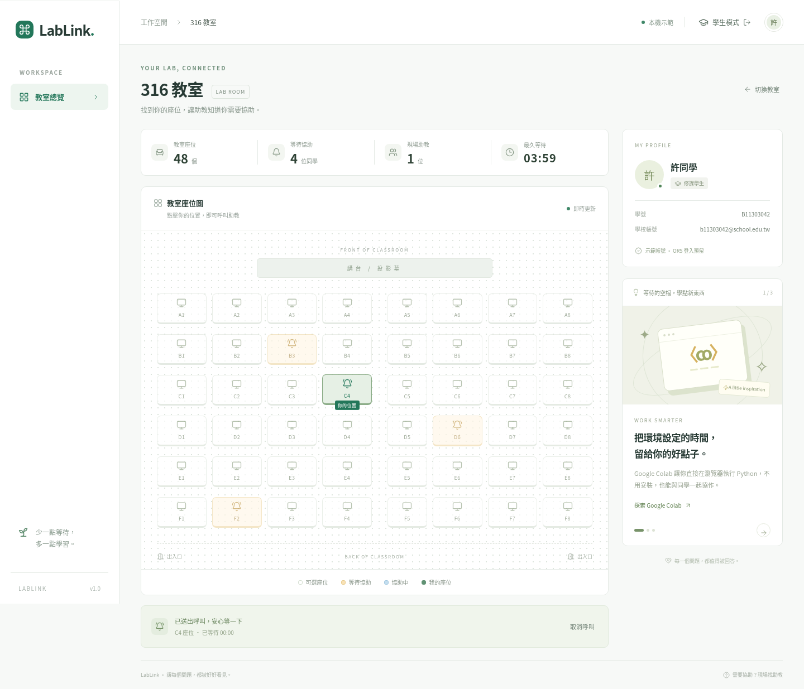
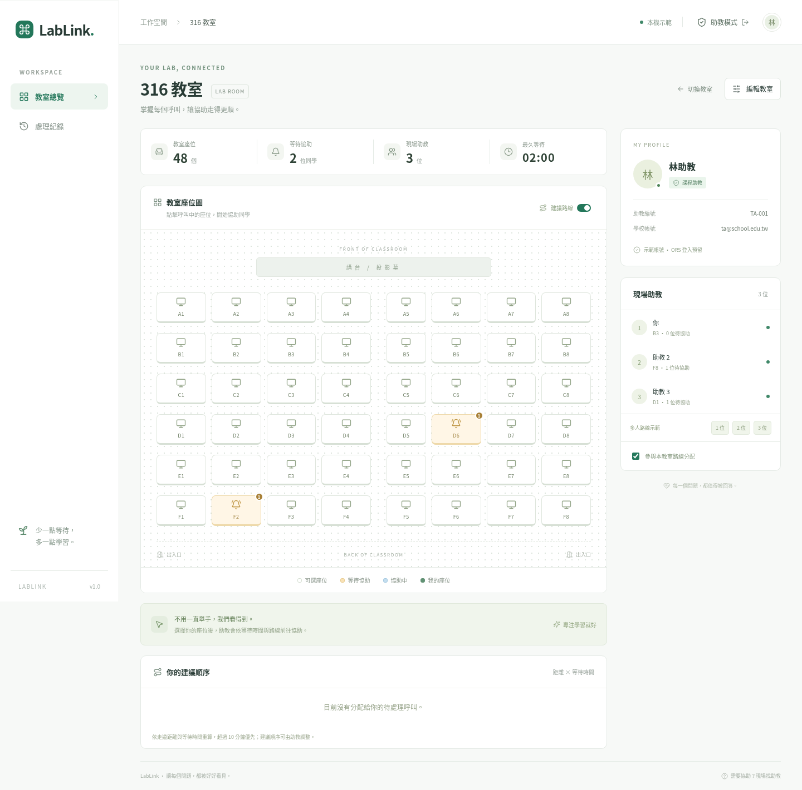

# LabLink

桌面版 Lab 呼叫系統（Svelte 5 + TypeScript）：繁體中文學生／助教介面、教室與座位編輯、即時呼叫、多人助教排序與完成紀錄。

## 介面預覽





## 本機體驗

```sh
npm install
npm run dev
```

開啟 http://localhost:5173。未設定 Firebase 時，登入頁提供學生／助教示範身份。呼叫存在 localStorage，同瀏覽器多分頁同步；示範預載 316 教室（6 張長桌、96 席）與三個呼叫。助教側欄的 1／2／3 位按鈕可示範多助教分配。這些按鈕只在示範模式出現。

## Firebase 設定

1. 建立 Firebase 專案與 Firestore，啟用 Firebase Auth 的 Google provider，加入網站部署網域至 Authorized domains。
2. 複製 `.env.example` 為 `.env.local`，填入 Firebase Web App 公開設定。沒有 API key 時只會使用本機示範模式。`VITE_ALLOWED_DOMAIN` 留空表示不限制網域。
3. 執行 `firebase deploy --only firestore:rules` 部署規則（專案記錄在 `.firebaserc`）。目前規則接受任何已驗證 email 的 Google 帳號；要限制學校網域，請依 `firestore.rules` 中 `member()` 的註解加上網域檢查，並設定 `VITE_ALLOWED_DOMAIN`。
4. 新增助教：在 Firestore 建立 `tas/{email}` 文件（文件 ID 為小寫 email，內容可為空），對方登入時即為助教，不需先登入；已登入者需重新登入。此集合只能由主控台或 Admin 權限寫入。也可用 Firebase Admin SDK 設定 custom claim `{ ta: true }`。正式環境不能自行選助教身份。可在 `profiles/{uid}` 放 `{studentId: "B..."}`，沒有設定時使用 email 前綴。
5. 第一位助教登入後新增教室，名稱填 316 即可；正式環境不自動寫入示範學生。教室由 Firestore 保存，含 seats、seatIds、activeCount 等欄位。

ORS 目前只作登入介面預留。正式登入使用 Firebase Google OAuth；將來 ORS 整合需由受信任的認證服務簽發 Firebase custom token。

瀏覽器直接使用 Firebase SDK 的 `onSnapshot` 和交易，不經 Worker 存取 Firestore，因此無需 fires2rest。學生不訂閱歷史紀錄；只有助教訂閱 history。教室呼叫中的顯示姓名與座位對同網域登入使用者可見，帳號 email 與學號不寫入呼叫。

## 呼叫與多人協助

- `calls/{uid}` 確保每個帳號全站最多一個呼叫；`seatLocks/{roomId_seatId}` 保護同一個座位，兩者與教室 activeCount 在同一筆交易更新。
- 接單交易會檢查 waiting 狀態與助教 currentCall，防止多人搶單及一位助教同時接多單。
- 學生可取消等待中的呼叫；開始協助後由該助教完成。助教點選呼叫座位即更新助教位置，完成時記錄到 history。
- 多助教的路線分配使用位置的曼哈頓距離、累積路程、已分配件數與等待時間。超过 10 分鐘的最早呼叫先分配；每個 waiting 呼叫只會分配一次。
- 這是近似啟發式排序，並非全域最佳化。走道距離以座位格線計算，長桌視為障礙物（到同一張桌子的另一側需繞過桌端）。座位編輯支援兩種桌型：長桌兩側座位（316 預設 3 × 2 張、每側 8 位）與傳統排桌；可停用座位、拖曳交換位置。自由桌形與實際障礙物（柱子、講台）尚未實作。
- 助教可暂停參與分配；有處理中呼叫時不能暫停、切換教室或登出。正式環境目前沒有自動離線偵測，關閉瀏覽器前請暫停參與。
- 即時重算的是「建議順序」，接單才會取得處理權；助教可自行改選其他 waiting 座位。

## Cloudflare Workers

```sh
npm run build
npx wrangler login
npm run deploy
```

`wrangler.jsonc` 使用 Workers Static Assets 與 SPA fallback。Firebase 設定為 Vite 建置變數；在部署管線設定同樣的 VITE_* 變數後重新建置。Workers 只提供網頁，不處理 Firebase 密鑰或資料。

目前沒有配置 Firebase 專案／部署帳號，故尚未連線正式資料庫或發布到 Cloudflare。執行上述步驟需你的專案與部署身份。

## 驗證

```sh
npm test
npm run check
npm run build
```

路線測試包含多人唯一分配、超時優先、處理中／已移除座位排除、零助教情境。正式上線前請在 Firebase Emulator 驗證 Security Rules 與跨瀏覽器同步；此工作區未配置 Firebase 專案。
